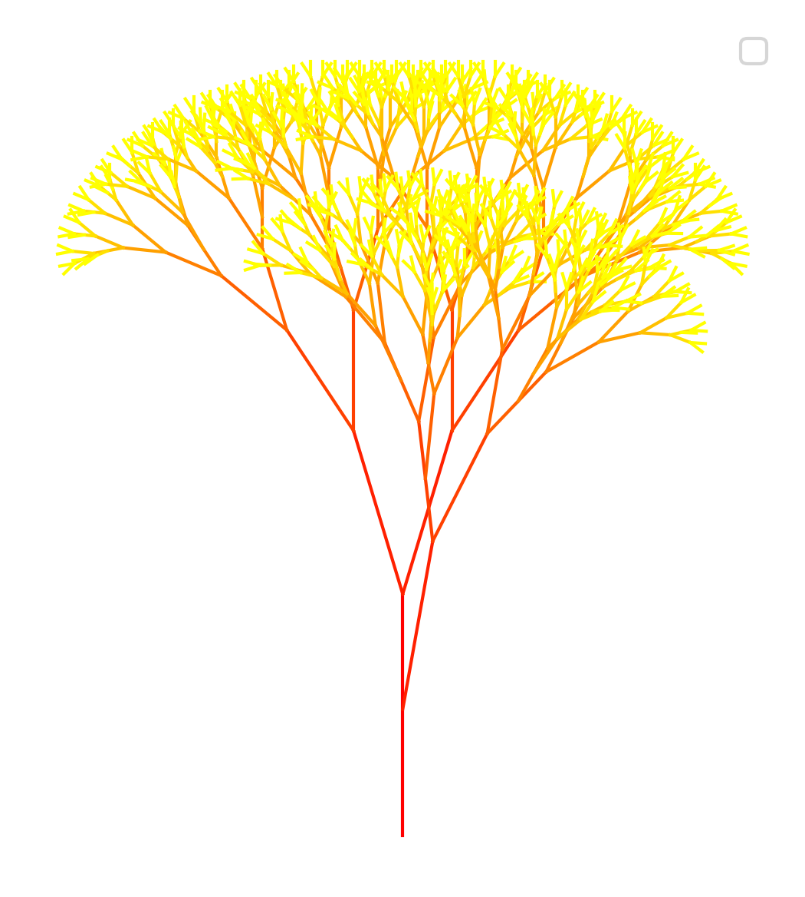
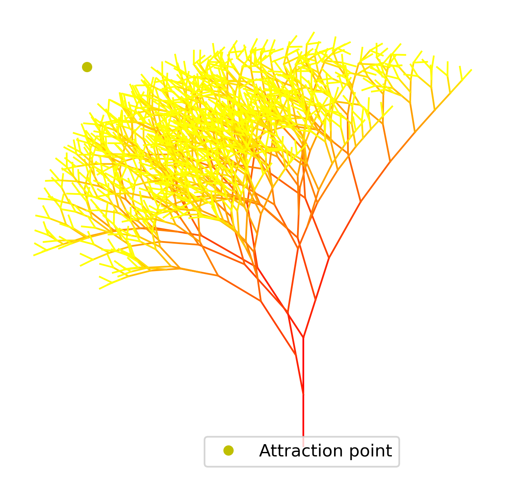
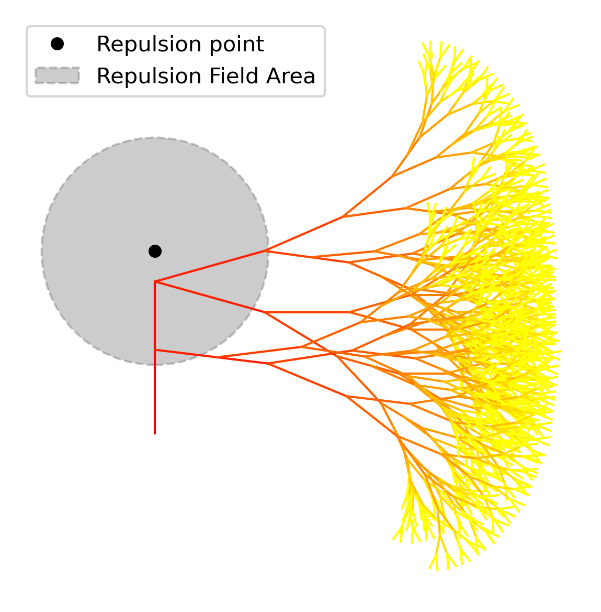
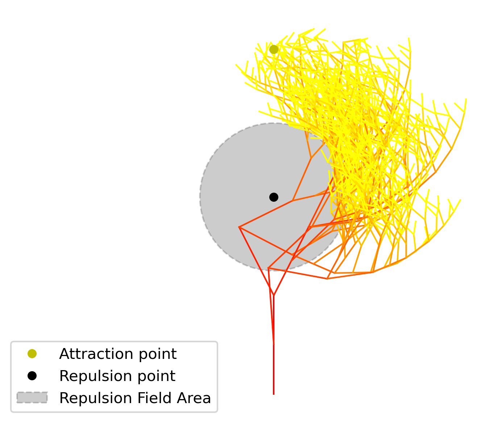
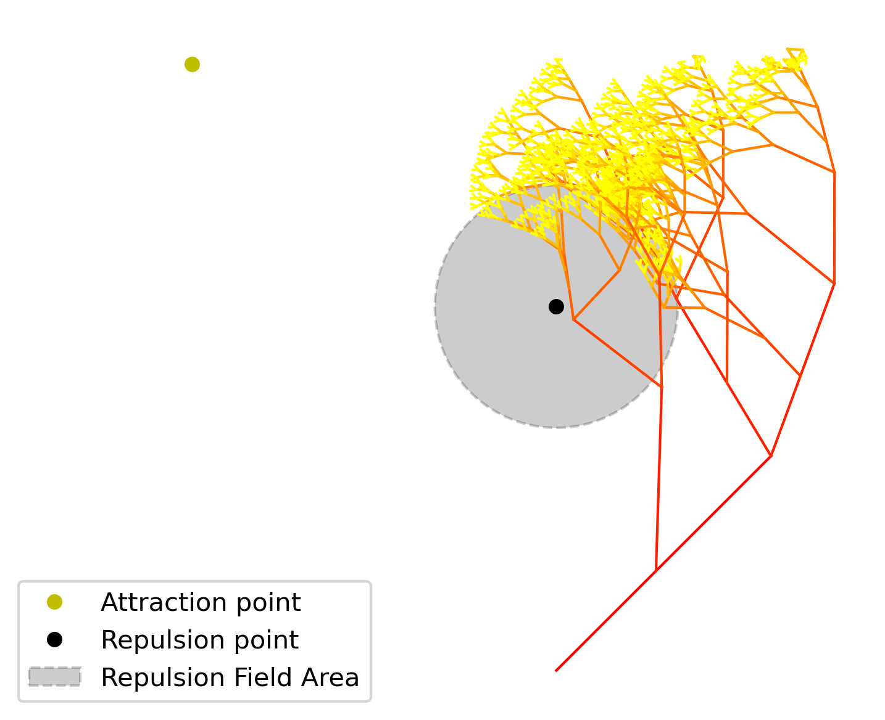
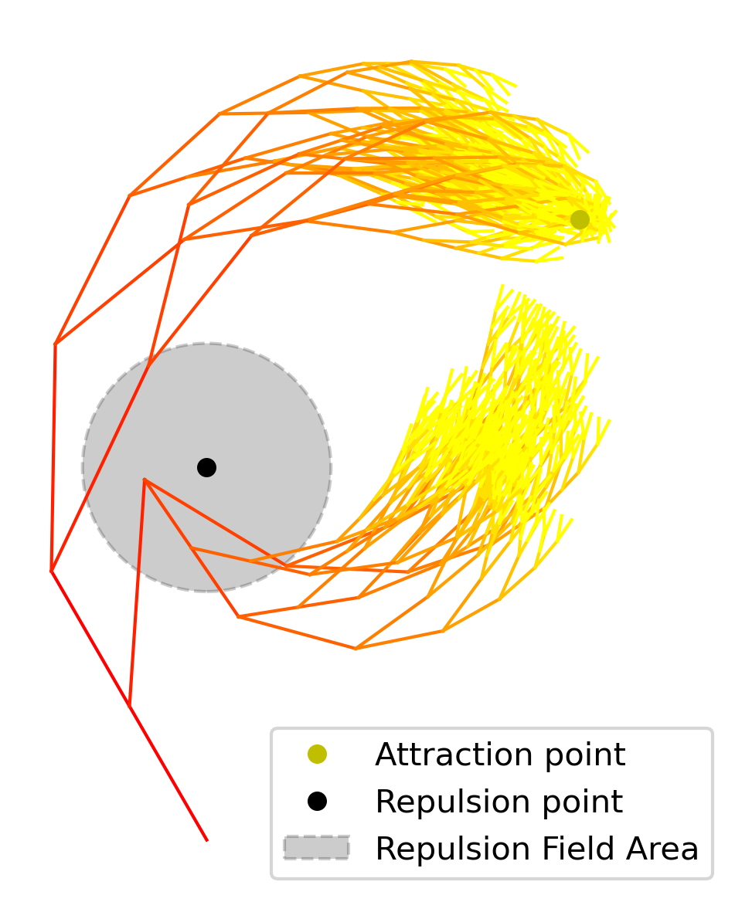

# Assignment 2: Fractal Generation Documentation

## Table of Contents

- [Pseudo-Code](#pseudo-code)
- [Technical Explanation](#technical-explanation)
- [Results](#results)
- [Challenges and Solutions](#challenges-and-solutions)
- [References](#references)

---

## Pseudo-Code

1. **Set Seed for callbacks to randomly generated patterns `random.seed()`**
    - **Optional**
      - Allow user input to specify seed
      - Print seed in command window to specify seed used if chosen randomly

2. **Define points of effect**
  - **Inputs**:
    - `Attraction_point`: Tuple of coordinates (x,y) (Point the tree will grow towards).
    - `Repulsion_field_center`: Tuple of coordinates (x,y) (Point the tree will try and avoid).
    - `Repulsion_field_radius`: Float/Int (Radius of the Repulsion field).
    - `Attraction_bias`: Float (The likelyhood of a branch being affected by the attraction point).
    - `Repulsion_bias`: Float (The likelyhood of a branch being affected by the repulsion point).

3. **Define Main Function `generate_fractal(start_point, angle, length, depth, max_depth, angle_change, length_scaling_factor,branching_factor, branch_probability, attraction_point, attraction_bias, repulsion_field_center, repulsion_bias, repulsion_field_radius)`**
   - **Inputs**:
     - `start_point`: Tuple of coordinates (x, y).
     - `angle`: Current angle in degrees.
     - `length`: Length of the current line segment.
     - `depth`: Current recursion depth.
     - `max_depth`: Int, maximum recursion depth.
     - `angle_change`: Float, angle change at each recursion.
     - `length_scaling_factor`: Float, scaling factor for the length.
     - `branching_factor`: Float, scaling factor for point along the branch.
     - `branch_probability`: Float, percentage chance of a branch being generated at a point along a parant branch.
     
   - **Process**:
     - **If** `depth` is greater than `max_depth`:
       - **Return** (End recursion).
     - **Else**:
       - Calculate `end_point` using trigonometry:
         - `end_x = start_x + length * cos(radians(angle))`
         - `end_y = start_y + length * sin(radians(angle))`
       - Create a line from `start_point` to `end_point` using Shapely.
       - Append line, depth and max depth to a list
       - **For** each branch (e.g., left and right):
         - **Calculate** angle between branch and points of effect:
           - `attraction_angle` = `math.degrees(math.atan2(attraction_point[1]- end_y, attraction_point[0] - end_x))`
           - `repulsion_angle` = `math.degrees(math.atan2(end_y - repulsion_field_center[1], end_x - repulsion_field_center[0]))`
         - **Calculate** distance of branch from repulsion point:
           - `distance_to_repulsion_field` = `math.sqrt((end_x - repulsion_field_center[0]) ** 2 + (end_y - repulsion_field_center[1]) ** 2)` 
         - **Calculate** new angle depending on impact of points of effect:
           - **if** distance of a branch is within the repulsion radius:
             - Left branch_angle: `bias_angle_plus` = `angle * (1 - attraction_bias - repulsion_bias) + attraction_angle * attraction_bias + repulsion_angle * repulsion_bias + angle_change`
             - Right branch_angle: `bias_angle_minus = angle * (1 - attraction_bias - repulsion_bias) + attraction_angle * attraction_bias + repulsion_angle * repulsion_bias - angle_change`
           - **else**
             - Left branch_angle: `bias_angle_plus` = `angle * (1 - attraction_bias) + attraction_angle * attraction_bias + angle_change`
             - Right branch_angle: `bias_angle_minus` = `angle * (1 - attraction_bias) + attraction_angle * attraction_bias - angle_change`
         - **Calculate** new length:
           - `new_length = length * length_scaling_factor`
         - **Calculate** new depth:
           - `next_depth` = `depth + 1`
         - **Recursive Call**:
           - `generate_fractal(end_point, bias_angle_plus, new_length, next_depth, max_depth, angle_change, length_scaling_factor, branching_factor, branch_probability, attraction_point, attraction_bias, repulsion_field_center, repulsion_bias, repulsion_field_radius)`
           - `generate_fractal(end_point, bias_angle_minus, new_length, next_depth, max_depth, angle_change, length_scaling_factor, branching_factor, branch_probability, attraction_point, attraction_bias, repulsion_field_center, repulsion_bias, repulsion_field_radius)`

         - **if** chance of creation of offshoot branch succeeds
           - `branch_x` = `start_x + branching_factor * (end_x - start_x)`
           - `branch_y` = `start_y + branching_factor * (end_y - start_y)`
           - `branch_point` = `(branch_x, branch_y)`
           - **Recursive call** for the offshoot 
             - `generate_fractal(branch_point, random.uniform(bias_angle_plus, bias_angle_minus) + random.uniform(-angle_change, angle_change), new_length, next_depth, max_depth, angle_change, length_scaling_factor, branching_factor, branch_probability, attraction_point, attraction_bias, repulsion_field_center, repulsion_bias, repulsion_field_radius)`
        - **Return** (After recursive calls).

4. **Define color function** get_color(depth,max_depth)
  - **return** color map depending on the depth

5. **Initialize Parameters**
   - Set: 
     - `start_point`. 
     - `initial_angle`. 
     - `initial_length`. 
     - `recursion_depth`.
     - `max_reursion_depth`.
     - `angle_change` add random angle changes.
     - `length_scaling_factor` add random length scaling.
     - `branching_factor` add random length scaling for point.
     - `branch_probability`.

3. **Call `generate_fractal` Function**
   - Begin the fractal generation by calling `generate_fractal(start_point, initial_angle, initial_length, recursion_depth, max_recursion_depth, angle_change, length_scaling_factor, branching_factor, branch_probability, attraction_point, attraction_bias, repulsion_field_center, repulsion_bias, repulsion_field_radius)`.

4. **Visualization**
   - Collect all the lines, depths and max depth generated.
   - Use Matplotlib to plot the lines.
   - Use get_color function to define a color based on depths.
   - Use Matplotlib to apply the color to the fractal.
   - Use Matplotlib to plot the points of effect.
   - Use Matplotlib to plot the repulsion field size.

5. **Cataloging**
   - Save the figure 

---

## Technical Explanation

In my implementation, the `generate_fractal` function recursively draws line sements representing branches of a fractal tree. The function calculates the end point of each line using trigonometry, position of the points of effect, a variable angle in relation to the points of effect and a variable length

At each recursion step, the function:

- Decreases the `length`by multiplying it with `length_scaling_factor` which is randomly chosen in the invertal of 0.6-0.8.
- Adjusts the `angle`by calculating the angle between the branch and the attraction point and then adding or subtracting `angle_change`to create branching.
- Further adjusting the `angle` if the branches branch into the `Repulsion_field_radius`. `Angle` is calculated between the `Repulsion_point_center` and the branch.
- Rolls a check to see if an offshoot branch should be created, which will follow the same trigonometric logic as the main branches.
- Recursively calls upon itself, generating further branches until the `max_recursion_depth` has been exhausted.

Another function has been added to apply different colors to the recursive lines depending on how deep in the list they get generated.

Then `matplotlib` has been used to visuallise the output.

This approach results in a fractal that will create a structure of branches that continually split into two smaller ones at the end points, with the possibility of a offshoot branch generating.
The branches then either grow towards a point of attraction or away from a repulsion point (within a set radius) or ignores the points depending on the probability of the points affecting the angular calculations.

To facilitate the ability to recall specific randomly generated geometry, a seed input option has been added for the user.
If a random seed is desired it can either be randomly chosen or generated by the script

---

## Results

Unless otherwise specified in each example, assume that the following **input parameters** were used:
  `start_point` = `(0, 0)`
  `initial_angle` = `90`
  `initial_length` = `100`
  `recursion_depth` = `0`
  `max_recursion_depth` = `8`
  `angle_change` = `random.uniform(5,40)`
  `length_scaling_factor` = `random.uniform(0.6, 0.8)`
  `branching_factor` = `random.uniform(0.3, 0.9)`
  `branch_probability` = `0.3`

### Fractal Pattern 1: Basic Fractal Tree with offshoots, ignoring points of effect

- **Parameters**:
  - `attraction_bias` = `0.0`
  - `repulsion_bias` = `0.0`
  - Random rolls:
  - `angle_change` = `18.161335705584825`
  - `length_scaling_factor` = `0.7073569280566738`
  - Seed: 10118

- **Observations**:
  - The fractal tree exhibits symmetry and balance in the endpoint recursions.
  - Offshoot branches appear at chosen branches and branch off in either a left or right leaning direction.
  - As the recursion depth increases, the level of detail in the branches increases.

### Fractal Pattern 2: Fractal Tree with offshoots, affected sightly by point of attraction

- **Parameters**:
  - `attraction_point` = `(-200,350)`
  - `attraction_bias` = `0.2`
  - `repulsion_bias` = `0.0`
  - Random rolls:
  - `angle_change` = `25.5383837628472`
  - `length_scaling_factor` = `0.7717129871943285`
  - Seed: 8961

- **Observations**:
  - The fractal tree exhibits a slight tendancy to grow towards the point of attraction, resulting in the tree having a heavier presence on the left side of the initial branch.
  - Offshoot branches appear at chosen branches and branch off in either a left or right leaning direction.
  - As the recursion depth increases, the level of detail in the branches increases.

### Fractal Pattern 3: Fractal Tree with offshoots, affected by the repulsion field

- **Parameters**:
  - `repulsion_field_center` = `(0,120)`
  - `repulsion_field_radius` = `75`
  - `attraction_bias` = `0.0`
  - `repulsion_bias` = `0.5`
  - Random rolls:
  - `angle_change` = `15.61122244379381`
  - `length_scaling_factor` = `0.7500303736725666`
  - Seed: 29122

- **Observations**:
  - The fractal tree will shift direction strongly away from the repulsion point if the branch is recursively generated inside of the repulsion field.
  - Upon exiting the repulsion field the tree will resume a normal symmetric growth
  - Offshoot branches appear at chosen branches and branch off in either a left or right leaning direction.
  - As the recursion depth increases, the level of detail in the branches increases.

### Fractal Pattern 4: Fractal Tree with offshoots, affected by points of effect

- **Parameters**:
  - `attraction_point` = `(-200,350)`
  - `repulsion_field_center` = `(0,200)`
  - `repulsion_field_radius` = `75`
  - `attraction_bias` = `0.4`
  - `repulsion_bias` = `0.4`
  - Random rolls:
  - `angle_change` = `26.911944370500223`
  - `length_scaling_factor` = `0.7780869429985721`
  - Seed: 3747

- **Observations**:
  - The fractal tree will shift direction away from the repulsion point if the branch is recursively generated inside of the repulsion field, while still trying to grow towards the attraction point.
  - Upon exiting the repulsion field the tree will resume growing towards the attraction point.
  - Offshoot branches appear at chosen branches and branch off in either a left or right leaning direction.
  - As the recursion depth increases, the level of detail in the branches increases.

### Fractal Pattern 5: Fractal Tree with offshoots, affected by points of effect

- **Parameters**:
  - `attraction_point` = `(-120,200)`
  - `repulsion_field_center` = `(0,120)`
  - `repulsion_field_radius` = `40`
  - `attraction_bias` = `0.5`
  - `repulsion_bias` = `0.4`
  - `initial angle` = `45`
  - Random rolls:
  - `angle_change` = `25.578661272370578`
  - `length_scaling_factor` = `0.6056042068891648`
  - Seed: 26327

- **Observations**:
  - The fractal tree starting at an angle will shift direction towards the point of attraction, shifting away from the repulsion point if the branch is recursively generated inside of the repulsion field.
  - Upon exiting the repulsion field (if entered) the tree will resume growing towards the attraction point.
  - Offshoot branches appear at chosen branches and branch off in either a left or right leaning direction.
  - As the recursion depth increases, the level of detail in the branches increases.

### Fractal Pattern 6: Fractal Tree with offshoots, affected by points of effect

- **Parameters**:
  - `attraction_point` = `(120,200)`
  - `repulsion_field_center` = `(0,120)`
  - `repulsion_field_radius` = `400`
  - `attraction_bias` = `0.5`
  - `repulsion_bias` = `0.4`
  - `initial angle` = `120`
  - Random rolls:
  - `angle_change` = `12.15309604125666`
  - `length_scaling_factor` = `0.7313562102698725`
  - Seed: 53244

- **Observations**:
  - The fractal tree starting at an angle will shift direction towards the point of attraction.
  - Upon entering the repulsion field the branches shift downwards away from the center of repulsion
  - Upon exiting the repulsion field the branches will resume growing towards the attraction point.
  - Offshoot branches appear at chosen branches and branch off in either a left or right leaning direction.
  - As the recursion depth increases, the level of detail in the branches increases.
  - Branches inside the repulsion field exhibit a tendancy to favor growing right to exit the field, indicating a likely flaw in the logic determining the angle calculations.

---

## Challenges and Solutions

- **Challenge**: Changing `angle_change` did not plot results in the expected angle.
  - **Solution**: Angles were calculated correctly and the issue only stemmed from how the plot was generated. Fixed by equaling the plot aspect `ax.set_aspect(equal)` .

- **Challenge**: Angles calculated inside the repulsion field seem to only send branches in a rightward direction.
  - **Solution**: NOT SOLVED. Likely a problem with the logic definition of the angular calculation in the repulsion field.

- **Challenge**: Implementing randomness without losing the overall structure.
  - **Solution**: Introduced randomness within controlled bounds for angles and lengths.

- **Challenge**: Retaining an overview of how the randomness is affecting the structure.
  - **Solution**: Introduce a seed to be able to recall specific structures, as well as outputting the random variables in the command window.

- **Challenge**: Correctly coloring the plot depending on the recursion depth.
  - **Solution**: Defining a function that will assign a color value depending on the recursion depth. Appending a list with the depth information of the fractal.

- **Challenge**: Controling if the points of effect are affecting the plot as expected.
  - **Solution**: Plotting the points of effect with the structure.

- **Challenge**: Legend sometimes covering up the structure.
  - **Solution**: Locking the legend in specific parts of the plot.

---

## References

- **Shapely Manual**: [https://shapely.readthedocs.io/en/stable/manual.html](https://shapely.readthedocs.io/en/stable/manual.html)
- **Matplotlib Pyplot Tutorial**: [https://matplotlib.org/stable/tutorials/introductory/pyplot.html](https://matplotlib.org/stable/tutorials/introductory/pyplot.html)
- **Random module manual**: [https://www.w3schools.com/python/module_random.asp](https://www.w3schools.com/python/module_random.asp)
- **Functions in python**: [https://www.w3schools.com/python/python_functions.asp](https://www.w3schools.com/python/python_functions.asp)
- **Generel information**: Slides from the lectures
- **Generel questions**: [https://chatgpt.com/](https://chatgpt.com/)

---